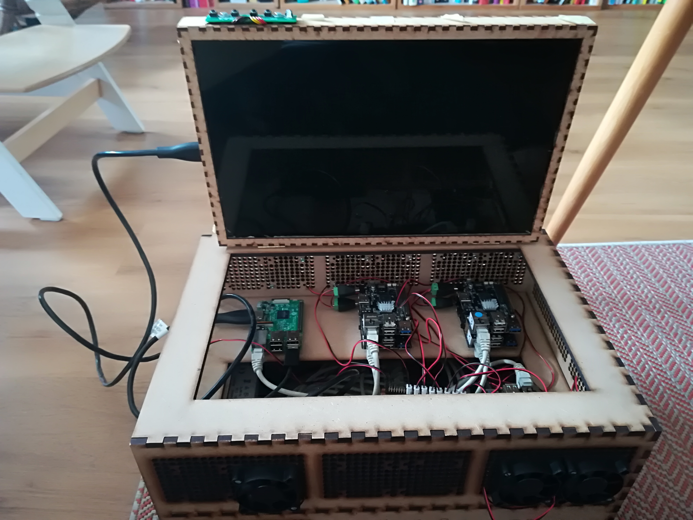

# Elastic-Cluster

This repository is a collection of resources needed to reproduce my Elastic-Cluster. 
The target audience are other makers, students, lecuterers, teachers and of course everyone interested.

## What is Elastic-Cluster?

Well, at its core it is just a capsulated local network of Raspberry Pi or derivates, with one 
Raspberry Pi 3+ as a interfacing device. I am using a number of [Rock64 by Pine](https://www.pine64.org/?product=rock64-media-board-computer)
devices, as they are available with 4GB of RAM. My purpose is to run an 
[Elasticsearch](https:/elastic.io/products/elasticsearch) instance on the cluster and see how fast it can get.
My personal main objective was to lern more about Elasticsearch and design my own system. 
The system is not (yet) designed to run as a productive, heavy-loaded, reliable Elasticsearch server. 

The wifi of the interfacing Raspi 3+ can then either be used to create a local network for all clients, or it can join any existing network to be available there. In the latter case, the Raspi has to be secured properly as it could otherwise expose the Pines to the internet. I installed a [NginX](https://www.nginx.com/) on the Pi, serving a web application to use the Elastic-Cluster. 

The web application I am using is a management platform for environmental metadata and observations (one day). It is called Elastic MetaCatalog2 (emc2) and available as a standalone [Project on Github](https://github.com/mmaelicke/emc2).

## Contents

* [Building Instructions for the Cluster](instructions.md)
* [Software Setup](software.md)
* **utils folder**: scripts, settings and instructions mainly for software setup
* **plans folder:** Casing vector graphics for lasercutter use

## Contributing

Contributions to elastic-cluster are more than welcome. For me this is and has always been a sandbox and playground project to learn more about networking, Raspberries, electronics and whatsoever. Contributions are more than welcome. 

However, there is a list with [ToDo's, Issues and Enhancements](todo.md) that I will probably face one day unless you get inspired by them and solve them.

