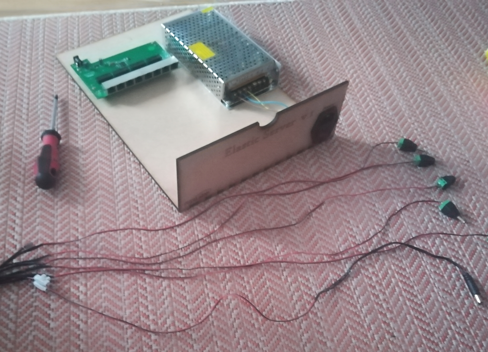
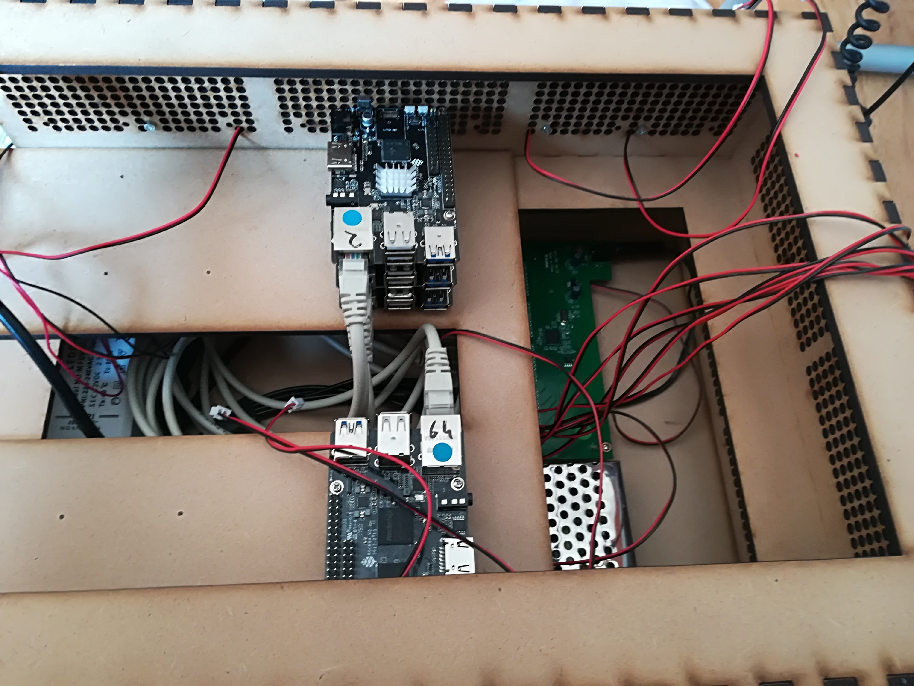
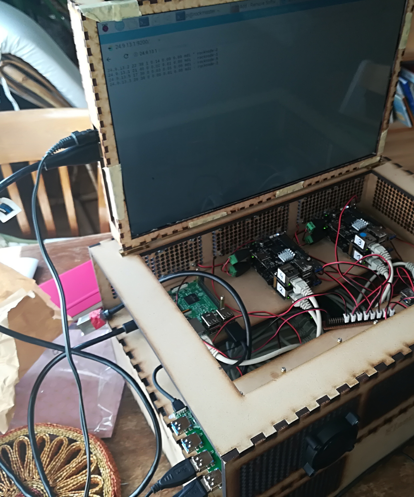

# Building Instructions

## Casing

The casing is designed for a Lasercutter. Use 5mm MDF, not acrylics, as the casing is plugged and not glued. Therefore you might need some abrasive paper, if your lasercutter focus is really small. 

The general idea is to build a shelf-like casing and put the hardware into two drawers, which are connected by a large hole in the middle. This way it is on the one hand possibe to reach each component without disassembling the whole cluser and on the other hand possible to extend the casing by a second one build on top of the first one.

At the time I designed the casing, I was not sure about where to put which component, that's why there are ventilation holes literally everywhere. In a future version, I will turn them into ventilaiton columns and just place them behind the Raspberries. The chosen ventilation hole have several 10m pathways, what makes the cutting an unneccessary long procedure.

My split up for the two drawers is to put the Raspberries and Pines in the upper and the power supply and networking into the lower drawer. The front panel of each drawer should then have holes for all connectors and plugs needed in the respective drawer.

A major improvement here would be to redesign the ventilation and put recesses into the top of the two long sides, where the foot of the casing fits in. That would make the server casing a stackable server casing.

Find more TODOs, enhancements or issues to be solved in the [GitHub Issue list](https://github.com/mmaelicke/elastic-cluster/issues)

## Drawer

### Power Supply and network

I designed two drawers so far. The lower one has a solid bottom, the upper one a hole in the middle for cables. None of them has mounting holes prepared, because at the time of design I was not sure about the division of parts.

The image above shows the lower drawer with the power unit and ethernet switch. I had an old LED strip power supply unit that operates on 5V and not on 12V. This is perfect for the Pines and Raspberries. My module has 200W. Following the [Rock64 website](https://www.pine64.org/?product=rock64-media-board-computer), one Pine can consume up to 3 ampere (I measured almost 2 ampere on a Pine calculating a Julia set using all four cores). At full load the power consumption 

would be 15W, my measured one 10W. That should last for 13 to 20 Rock64.

------

The green one in the image above is an old ethernet switch. It is a 8 port 100Mbit switch, which could be a problem as Elasticsearch might produce some heavy network traffic. But there is room for improvement as the Pines have a Gigabit ethernet port, therefore a 16 Port Gigabit switch (which might cost up to 120€) would be a valuable replacement.

I want to leave one port open, for connecting a Laptop, and another port is needed by the Raspberry Pi 3. The latter will run the nginx server and serve the application for the client. In my design that will also be the only device allowed to connect to foreign networks or the internet. That will leave 6 ports for the cluster nodes here. At the moment I have 5 connected.

### Cluster Nodes

After trying around a little bit, I found that three stacks of pines fit on each side of the upper drawer (The one with the hole in the middle). This should make it possible to still connect a HDMI cable to each of the nodes if needed for debugging. Each stack can handle 3 pines easily, a fourth can physically be mounted, but there will be almost no space to the top of the casing. The dimensions were limited by the MDF material we hab available in our FabLab in Freiburg, the great [FREILab](http://freilab.de). Putting three pines on top of each other will still give room to 27 units, or 26 nodes and the Raspberry.

The above Image shows my 5 cluster nodes on two stacks. You can see how the upper drawer is pulled out a bit and the lower one becomes visible. You can also see all the cables flying around in the server, with just 5 nodes and these are not fully connected. Therefore the bigger issue in extending the cluster is where to put all the cable. The image below shows the pine stack in a bit more detail.

### Ventilation

For ventilation, a ridicilous amount of holes has been added to each side of casing, as can be seen in the image above. This was done, because at the time of design it was not clear where the pine stacks will be located. However, inside the cascade of ventilation holes are smaller, irregular holes. These can be used to mount a 50mm GPU fan on top of them. Most of these fans are 12V fans, but from my experience they ventilate enough at 5V. This would prevent you from supplying more than one voltage to the cluster. In my version, all fans run at constant speed as soon as the cluster is powered. In the image above, you can see, that I soldered a 'distribution board' from what I had available. Definitely not a clean solution.

There is enough space for improvement. You could either put a thermoresistor into the fan supply circuit in order to slow them down if it's not hot enough. The other possibility would be to measure the CPU temperature directly on all nodes by the Raspberry and control the fan speed accordingly. Just ideas.

### Screen

You my have seen on the main image, that I mounted a screen as a cover. This is a rather old laptop screen panel (1024x768 if you remember those times). As it was a quite common LCD panel, one could buy a driver board on ebay for ~30-40$. Then, this board is just connected to the Pi by the HDMI port. This is of couse just a very specific solution, but it turned out to be very helpful during development. The image below shows the Raspian OS on  the connected screen. 

